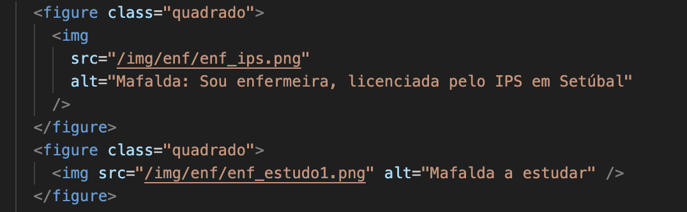
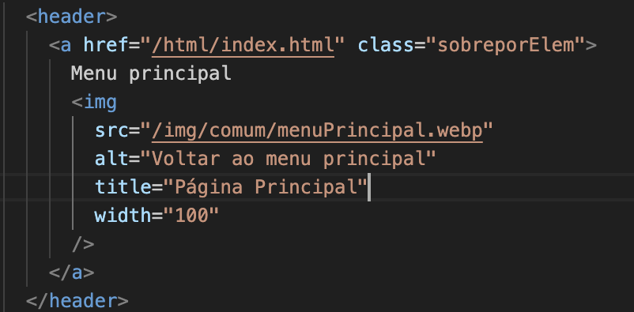
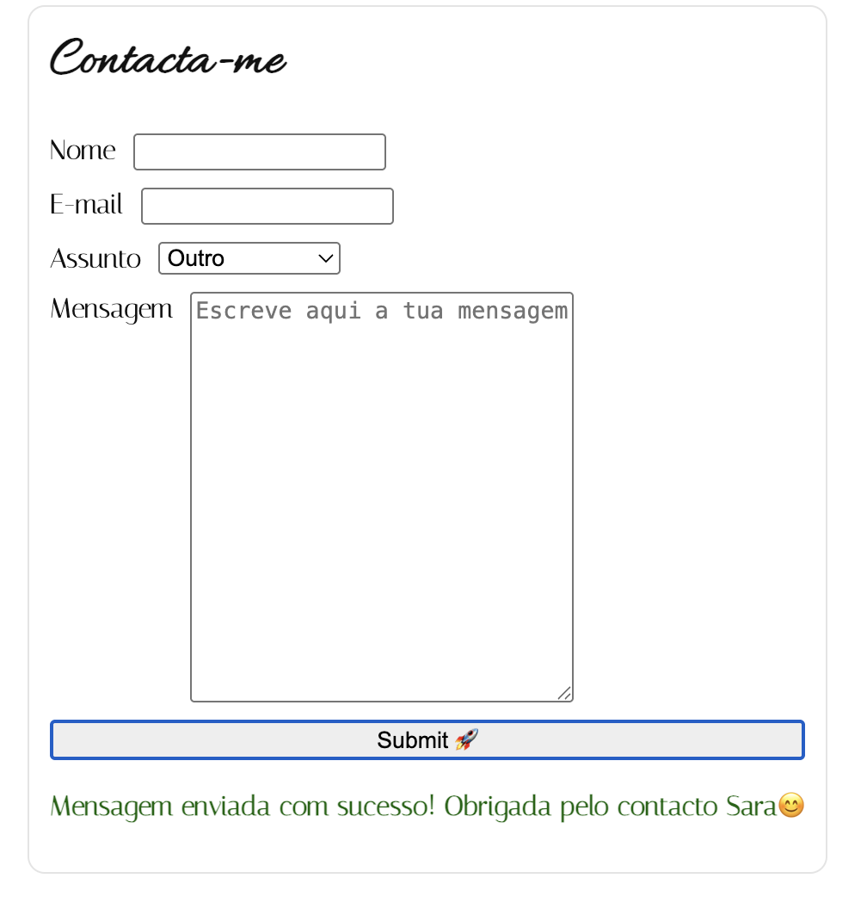
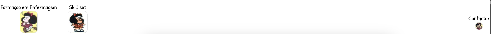

# Portfólio realizado por Sara Pina

# Link repositório GITHUB:
https://github.com/sararmpina-prog/Portfolio_BD_Pina.git

Para aceder: Usar Live Server na pasta do portfólio. 
        
# Passos para execução da página

Abrir primeiramente index.html. Representa o menu de navegação para as restantes páginas. 

Daqui pode-se fazer a selecção para as respetivas páginas.
A ordem optimizada será seguir o menu de navegação:
    Sobre mim
    Percurso Profissional Enfermagem
    Percurso Profissional nos Estudos
    Skill Set
    Contacto

Contudo existem secções independentes, e as únicas para as quais recomendo a leitura sequencial são: Percurso Profissional Enfermagem seguida de Percurso Profissional nos Estudos.

Em qualquer secção, pode-se navegar para a página anterior; para a página seguinte; para o formulário de contacto (final) e para o menu principal.

Qualquer destas secções abre em separador à parte, mantendo sempre a página principal (index.html/menu de navegação) disponível.

# Principais decisões tomadas e justificação da adequação

1. Escolha do tema e tópicos

    Decidi criar um portfólio profissional visto que foi o meu primeiro projeto com HTML e CSS. A ideia base que tive para este projeto foi evocar a experiência da leitura de um livro, em concreto, de uma banda desenhada (BD). 

    Decidi incluir tanto a componente profissional (experiência profissional anterior em enfermagem e requalificação profissional) como a componente pessoal. Esta última, porque considero pertinente num contexto de recrutamento haver uma área dedicada tanto aos interesses e hobbies como adicionalmente às soft skills.

    Usei a banda-desenhada da "Mafalda", que acaba por funcionar como um template para a concretização desta ideia. Em contexto que não académico, teria que realizar uma opção diferente devido aos direitos de autor.

2. Cariz académico > cariz profissional

    A minha ideia para a realização deste portfólio foi colocar em prática o conceito ilustrativo de contar a história por meio de uma BD. Contudo, num contexto real, faria as adaptações necessárias ao formato e conteúdos de forma a conferir ao portfolio um cariz mais profissional. 

3. Uso de CSS > frameworks e Mobile First

    Decidi usar CSS de base em vez de frameworks para me familiarizar mais com o mesmo e construir "manualmente" os estilos desejados.

    Os _comics_ - imagens - foram colocados numa grid cuja responsividade foi pensada na lógica "mobile first", assumindo inicialmente uma coluna única, e expandindo para duas colunas em ecrãs maiores, a partir de 768px. 
    Para ecrãs com 1024px ou maiores, todo o _main_ (parágrafo descritivo e grid de comics), que por sua vez é disposto em outra grid, passa a ocupar um total de 3 colunas.

    Explorei outras propriedades CSS para atribuir "o layout de banda desenhada", tentando uniformizar o espaço ocupado pelas diferentes imagens.  

    Para ajudar à uniformização usei propriedades como `aspect-ratio`, `overflow` e `object-fit`. Neste último, optei por usar a atribuição de "contain" por manter melhor qualidade de imagem sem perda de conteúdo visual.

4. Inclusão de um parágrafo complementar por secção de banda desenhada devido à acessibilidade.

     Fiz as seguintes validações para garantir a acessibilidade do site: 
      - Uso correcto da estrutura html semântica, e utilização de atributos _aria_ sempre que adequado

      - Atributo alt corretamente usado nas imagens (identificação da legenda aplicada), representação descritiva da imagem e/ou da sua utilização.
     (Seguem-se três exemplos abaixo).

    Contudo, considero que continua a ser uma experiência particularmente visual e, consequentemente, o detalhe na história/informação é mais limitado relativamente ao que pode ser transmitido através da narrativa. Assim, decidi incorporar um parágrafo descritivo, complementando os _comics_ em cada secção. 

5. Interatividade

    Optei por só aplicar JS na última página do portfólio (contacto), aquando da submissão do formulário.
    Apesar de ser apologista de criar mais momentos de interatividade com o utilizador no uso de interfaces pelo dinamismo gerado, considero que neste portfólio a sua aplicação essencial resume-se à validação da entrega. 

    

    De facto, considerei inclusive adicionar mais interatividade ao menu de navegação (index.html), mas considero que não iria trazer vantagem na experiência e até acessibilidade dessa página. Assim, optei por aplicar apenas um destaque na cor da opção selecionada em _hover_, acompanhada por uma animação discreta do texto, ambos com o intuito de favorecer a usabilidade da página.

6. Inclusão da referência para a página final (contacto) em todas as páginas

    Após a apresentação do portfólio, segui a sugestão de incorporação da referência para a página final (contacto) em todas as secções.
    Decidi manter essa referência alinhada com a estrutura visual da página incluída no menu de navegação do rodapé das páginas.
    Defini com um tamanho reduzido face aos elementos de interface próximos (página anterior e página seguinte), de forma a não prejudicar a usabilidade das páginas, evitando o ruído visual e eventual dificuldade na navegação pelas seções.

    A alteração ficou como representada:

     

 7. Rodapé incluído na página principal/menu de navegação com mensagem

    Optei por colocar a mensagem "Imagens da personagem Mafalda © Quino — uso exclusivo para fins educativos, sem finalidade comercial" no rodapé da página principal. Inicialmente, a mensagem era visível apenas na secção "sobre mim", no rodapé.

    A alteração descrita acima (ponto 6) causou ligeiras alterações no rodapé das páginas, e adicionalmente, considerei que esta informação deveria estar expressa na primeira página antes de aceder a qualquer uma das outras, para maior visibilidade e melhor proteção dos direitos de autor. 

    Boa leitura!

 
